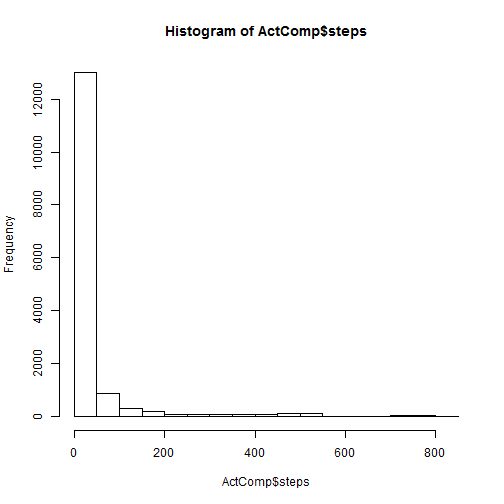
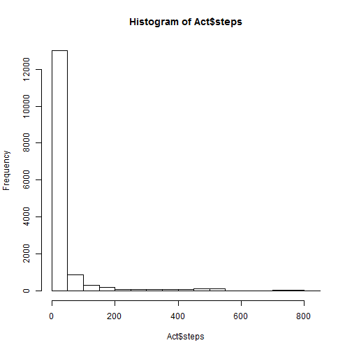
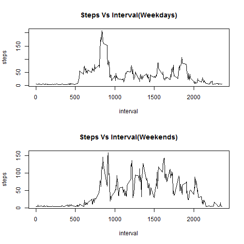

Step 1 - Load the data

```r
Act<-read.csv("activity.csv",header=TRUE ,na.strings="NA", stringsAsFactors=F)
ActComp<-Act[complete.cases(Act),]
```
Step 2 - Mean total number of steps per day

```r
sum(ActComp$steps)
```

```
## [1] 570608
```

```r
hist(ActComp$steps)
```

 

```r
mean(ActComp$steps)
```

```
## [1] 37.3826
```

```r
median(ActComp$steps)
```

```
## [1] 0
```
Step 3 - average daily activity pattern

```r
AgData<-aggregate(steps~interval,data=ActComp,FUN=mean)
```

```
## Error in get(as.character(FUN), mode = "function", envir = envir): object 'FUN' of mode 'function' was not found
```

```r
plot(AgData,type="l")
```

 

```r
AgData[which.max(AgData$steps),1]
```

```
## [1] 835
```
Step 4 - Impute the missing data

```r
print(paste("Number of NAs ",sum(is.na(Act)),sep=" =  "))
```

```
## [1] "Number of NAs  =  2304"
```

```r
library(Hmisc)
Act$interval<-impute(Act$interval,mean)
Act$steps<-impute(Act$steps,mean)
```

```
## Error in impute.default(Act$steps, mean): length of vector of imputed values != no. NAs in x
```

```r
hist(Act$steps)
```

 

```r
mean(Act$steps)
```

```
## [1] NA
```

```r
median(Act$steps)
```

```
## [1] NA
```
There is no impact of the missing data on the mean and median of the total steps per day

Step 5 - Differences in activity pattern between weekdays and weekends

```r
Act$weekday<-weekdays(as.Date(Act$date))
Act[Act$weekday %in% c("Saturday","Sunday"),4]<-"Weekend"
Act[Act$weekday!="Weekend",4]<-"Weekday"
Act.weekday<-as.factor(Act$weekday)
AgWE<-aggregate(steps~interval,data=Act[Act$weekday=="Weekend",],FUN=mean)
```

```
## Error in get(as.character(FUN), mode = "function", envir = envir): object 'FUN' of mode 'function' was not found
```

```r
AgWD<-aggregate(steps~interval,data=Act[Act$weekday=="Weekday",],FUN=mean)
```

```
## Error in get(as.character(FUN), mode = "function", envir = envir): object 'FUN' of mode 'function' was not found
```

```r
par(mfrow=c(2,1))
plot(AgWD,type="l",main = "Steps Vs Interval(Weekdays)")
plot(AgWE,type="l",main = "Steps Vs Interval(Weekends)")
```

 
